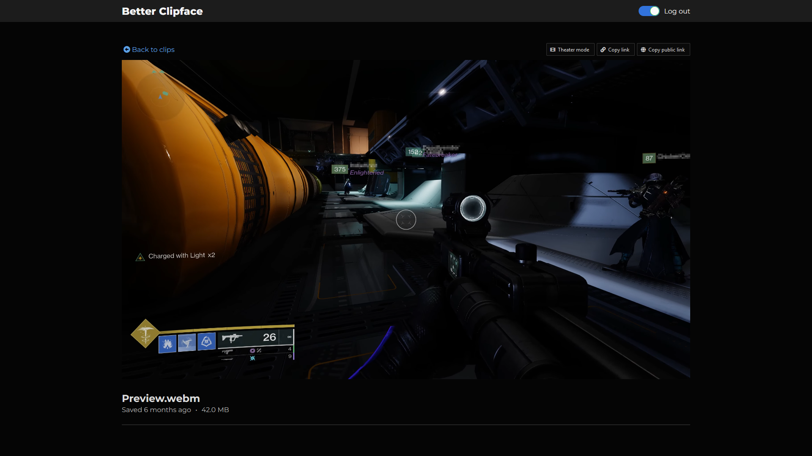
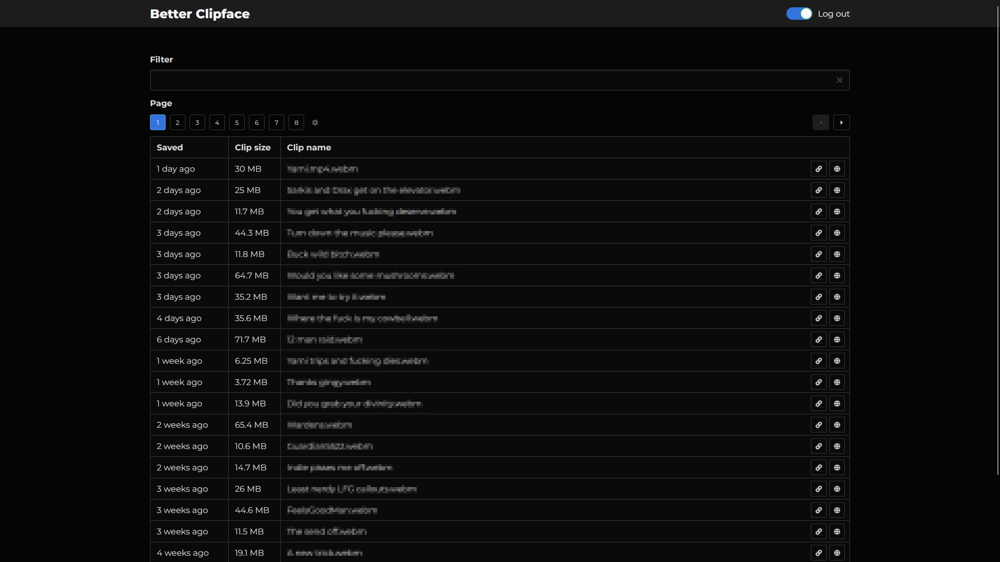

**Better Clipface** is a fork of Clipface with an improved UI/UX and greater functionality.

## Features

- Search feature with real-time results
- Simple user interface with light and dark mode support
- Embed support thanks to the use of Open Graph meta tags
- "Favorite" feature so the best videos are always easy to find
- Video thumbnail generation

## Preview





## Getting Started

### Using Docker

```
docker run -d --restart unless-stopped \
  --name better-clipface \
  -v /host/path/to/clips:/data \
  -p 3535:80 \
  -e PASSWORD="password123" \
  -e PAGE_TITLE="Streamify" \
  nfrederick023/better-clipface:latest
```

## Configuration

Better Clipface uses [node-config](https://github.com/lorenwest/node-config) for
configuration management. This means that Clipface can be configured using a
config file or by setting environment variables (or both.) For Docker
deployments, using environment variables is the most convenient option.

List of config parameters:

- `app_path` - The absolute path of the directory containing the clips
  that Clipface should host. This defaults to `"/data"`.

  **Default value**: `"/data"`<br />
  **Environment variable**: `APP_PATH`

- `page_title` - Title displayed on the clip list page. If not set
  (which is the default), no title will be displayed and the
  header will be significantly smaller.

  **Default value**: `Better Clipface`<br />
  **Environment variable**: `PAGE_TITLE`

- `password` - A password used to protect your Better Clipface instance. By
  default this is enabled because there is another variable below which
  when disabled allows for a more secure way to have a public facing library.

  **Default value**: `adminadmin`<br />
  **Environment variable**: `PASSWORD`

- `thumbnail_size` - Used to adjust the size of the thumbnails generated.
  We recommend using a size that matches an aspect ratio of 16:9 as that
  is the aspect ratio of the viewport when embedded.

  **Default value**: `1280x720`<br />
  **Environment variable**: `THUMBNAIL_SIZE`

- `private_library` - Used to adjust whether or not your entire library of
  videos can be publicly accessible. If set to false, users not logged in can view
  all of your videos, but cannot adjust the favorite or privacy status.

  **Default value**: `true`<br />
  **Environment variable**: `PRIVATE_LIBRARY`
